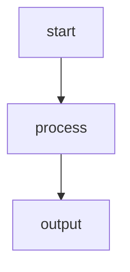

# Iris
[](https://github.com/erikhoward/iris/actions/workflows/ci.yml)&nbsp;
[](https://goreportcard.com/report/github.com/erikhoward/iris)&nbsp;
[](https://github.com/erikhoward/iris/blob/main/LICENSE)

Iris is a Go SDK and CLI for building AI-powered applications and agent workflows. It provides a unified interface for working with large language models (LLMs), making it easy to integrate AI capabilities into your Go projects.

## Why Iris?

Building AI applications often requires:
- Managing multiple LLM provider APIs with different interfaces
- Handling streaming responses, retries, and error normalization
- Securely storing and managing API keys
- Creating reusable agent workflows

Iris solves these problems by providing:
- **Unified SDK**: A consistent Go API across providers (OpenAI, Anthropic, Google Gemini)
- **Fluent Builder Pattern**: Intuitive, chainable API for constructing requests
- **Built-in Streaming**: First-class support for streaming responses with proper channel handling
- **Secure Key Management**: Encrypted local storage for API keys
- **Agent Graphs**: A framework for building stateful, multi-step AI workflows
- **CLI Tool**: Quickly test models and manage projects from the command line

## Features

### SDK Features
- Fluent chat builder with `System()`, `User()`, `Assistant()`, `Temperature()`, `MaxTokens()`, and `Tools()`
- Non-streaming and streaming response modes
- Tool/function calling support
- **Responses API support** for GPT-5+ models with reasoning, built-in tools (web search, code interpreter), and response chaining
- Automatic retry with exponential backoff
- Telemetry hooks for observability
- Normalized error types across providers

### CLI Features
- `iris chat` - Send chat completions from the terminal
- `iris keys` - Securely manage API keys with AES-256-GCM encryption
- `iris init` - Scaffold new Iris projects
- `iris graph export` - Export agent graphs to Mermaid or JSON

### Agent Framework
- Directed graph-based workflow execution
- Stateful execution with shared state across nodes
- YAML-based graph definitions
- Visual export to Mermaid diagrams

## Installation

### SDK

```bash
go get github.com/erikhoward/iris
```

### CLI

```bash
go install github.com/erikhoward/iris/cli/cmd/iris@v0.1.0
```

## Quick Start

### Using the SDK

```go
package main

import (
    "context"
    "fmt"
    "os"

    "github.com/erikhoward/iris/core"
    "github.com/erikhoward/iris/providers/openai"
)

func main() {
    // Create a provider
    provider := openai.New(os.Getenv("OPENAI_API_KEY"))

    // Create a client
    client := core.NewClient(provider)

    // Send a chat request
    resp, err := client.Chat("gpt-4o").
        System("You are a helpful assistant.").
        User("What is the capital of France?").
        Temperature(0.7).
        GetResponse(context.Background())

    if err != nil {
        fmt.Fprintln(os.Stderr, "Error:", err)
        os.Exit(1)
    }

    fmt.Println(resp.Output)
    fmt.Printf("Tokens used: %d\n", resp.Usage.TotalTokens)
}
```

### Using Anthropic Claude

```go
package main

import (
    "context"
    "fmt"
    "os"

    "github.com/erikhoward/iris/core"
    "github.com/erikhoward/iris/providers/anthropic"
)

func main() {
    // Create an Anthropic provider
    provider := anthropic.New(os.Getenv("ANTHROPIC_API_KEY"))

    // Create a client
    client := core.NewClient(provider)

    // Send a chat request
    resp, err := client.Chat("claude-sonnet-4-5").
        System("You are a helpful assistant.").
        User("What is the capital of France?").
        GetResponse(context.Background())

    if err != nil {
        fmt.Fprintln(os.Stderr, "Error:", err)
        os.Exit(1)
    }

    fmt.Println(resp.Output)
}
```

### Using Google Gemini

```go
package main

import (
    "context"
    "fmt"
    "os"

    "github.com/erikhoward/iris/core"
    "github.com/erikhoward/iris/providers/gemini"
)

func main() {
    // Create a Gemini provider
    provider := gemini.New(os.Getenv("GEMINI_API_KEY"))

    // Create a client
    client := core.NewClient(provider)

    // Send a chat request
    resp, err := client.Chat("gemini-2.5-flash").
        System("You are a helpful assistant.").
        User("What is the capital of France?").
        GetResponse(context.Background())

    if err != nil {
        fmt.Fprintln(os.Stderr, "Error:", err)
        os.Exit(1)
    }

    fmt.Println(resp.Output)
}
```

Gemini models with thinking/reasoning support:

```go
// Use reasoning with Gemini 2.5 models (budget-based)
resp, err := client.Chat("gemini-2.5-pro").
    User("Solve this complex problem step by step").
    ReasoningEffort(core.ReasoningEffortHigh).
    GetResponse(ctx)

// Access reasoning if available
if resp.Reasoning != nil && resp.Reasoning.Output != "" {
    fmt.Println("Thinking:", resp.Reasoning.Output)
}
```

### Streaming Responses

```go
stream, err := client.Chat("gpt-4o").
    User("Write a short poem about Go.").
    Stream(context.Background())

if err != nil {
    log.Fatal(err)
}

// Print chunks as they arrive
for chunk := range stream.Ch {
    fmt.Print(chunk.Delta)
}
fmt.Println()

// Or use DrainStream to collect everything
resp, err := core.DrainStream(ctx, stream)
```

### Using Tools

```go
// Define a tool
weatherTool := mytools.NewWeatherTool()

resp, err := client.Chat("gpt-4o").
    User("What's the weather in San Francisco?").
    Tools(weatherTool).
    GetResponse(ctx)

if len(resp.ToolCalls) > 0 {
    // Handle tool calls
    for _, call := range resp.ToolCalls {
        fmt.Printf("Tool: %s, Args: %s\n", call.Name, call.Arguments)
    }
}
```

### Using the Responses API (GPT-5)

GPT-5 models automatically use OpenAI's Responses API, which provides advanced features like reasoning, built-in tools, and response chaining.

```go
// GPT-5 uses the Responses API automatically
resp, err := client.Chat("gpt-5").
    Instructions("You are a helpful research assistant.").
    User("What are the latest developments in quantum computing?").
    ReasoningEffort(core.ReasoningEffortHigh).
    WebSearch().
    GetResponse(ctx)

if err != nil {
    log.Fatal(err)
}

fmt.Println(resp.Output)

// Access reasoning summary if available
if resp.Reasoning != nil {
    for _, summary := range resp.Reasoning.Summary {
        fmt.Println("Reasoning:", summary)
    }
}

// Response chaining - continue from a previous response
followUp, err := client.Chat("gpt-5").
    ContinueFrom(resp.ID).
    User("Can you elaborate on the most promising approach?").
    GetResponse(ctx)
```

### Using the CLI

```bash
# Set up your API key (stored encrypted)
iris keys set openai
iris keys set anthropic
iris keys set gemini

# Chat with OpenAI
iris chat --provider openai --model gpt-4o --prompt "Hello, world!"

# Chat with Anthropic Claude
iris chat --provider anthropic --model claude-sonnet-4-5 --prompt "Hello, world!"

# Chat with Google Gemini
iris chat --provider gemini --model gemini-2.5-flash --prompt "Hello, world!"

# Chat with GPT-5 (uses Responses API automatically)
iris chat --provider openai --model gpt-5 --prompt "Explain quantum entanglement"

# Stream responses
iris chat --provider openai --model gpt-4o --prompt "Tell me a story" --stream
iris chat --provider anthropic --model claude-sonnet-4-5 --prompt "Tell me a story" --stream

# Get JSON output
iris chat --provider openai --model gpt-4o --prompt "Hello" --json

# Initialize a new project
iris init myproject

# Export an agent graph to Mermaid
iris graph export agent.yaml --format mermaid
```

## Project Structure

```
iris/
├── core/           # Core SDK types and client
├── providers/      # LLM provider implementations
│   ├── openai/     # OpenAI provider
│   ├── anthropic/  # Anthropic Claude provider
│   └── gemini/     # Google Gemini provider
├── tools/          # Tool/function calling framework
├── agents/         # Agent graph framework
│   └── graph/      # Graph execution engine
├── cli/            # Command-line interface
│   ├── cmd/iris/   # CLI entry point
│   ├── commands/   # CLI commands
│   ├── config/     # Configuration loading
│   └── keystore/   # Encrypted key storage
└── tests/          # Integration tests
```

## Configuration

Iris looks for configuration at `~/.iris/config.yaml`:

```yaml
default_provider: openai
default_model: gpt-5  # or gpt-4o for older models

providers:
  openai:
    api_key_env: OPENAI_API_KEY
  anthropic:
    api_key_env: ANTHROPIC_API_KEY
  gemini:
    api_key_env: GEMINI_API_KEY
```

## Supported Providers

| Provider | Status | Features |
|----------|--------|----------|
| OpenAI | Supported | Chat, Streaming, Tools, Responses API (GPT-5+) |
| Anthropic | Supported | Chat, Streaming, Tools |
| Google Gemini | Supported | Chat, Streaming, Tools, Reasoning |
| Ollama | Planned | - |

### Gemini Models

| Model ID | Features |
|----------|----------|
| `gemini-3-pro-preview` | Chat, Streaming, Tools, Reasoning (thinkingLevel) |
| `gemini-3-flash-preview` | Chat, Streaming, Tools, Reasoning (thinkingLevel) |
| `gemini-2.5-pro` | Chat, Streaming, Tools, Reasoning (thinkingBudget) |
| `gemini-2.5-flash` | Chat, Streaming, Tools, Reasoning (thinkingBudget) |
| `gemini-2.5-flash-lite` | Chat, Streaming, Tools, Reasoning (thinkingBudget) |

## Agent Graphs

Define agent workflows in YAML:

```yaml
name: my-agent
entry: start

nodes:
  - id: start
    type: prompt
    config:
      template: "Process: {{.input}}"
  - id: process
    type: llm
    config:
      model: gpt-5
  - id: output
    type: output

edges:
  - from: start
    to: process
  - from: process
    to: output
```

Export to Mermaid for visualization:

```bash
iris graph export agent.yaml
```



## Development

### Prerequisites
- Go 1.24 or later

### Building

```bash
# Build everything
go build ./...

# Run tests
go test ./...

# Run integration tests (requires IRIS_OPENAI_API_KEY)
go test -tags=integration ./tests/integration/...
```

### Module Structure

Iris uses a single Go module at the repository root. All packages are imported from `github.com/erikhoward/iris/*`:

```go
import (
    "github.com/erikhoward/iris/core"
    "github.com/erikhoward/iris/providers/openai"
    "github.com/erikhoward/iris/providers/anthropic"
    "github.com/erikhoward/iris/providers/gemini"
    "github.com/erikhoward/iris/tools"
    "github.com/erikhoward/iris/agents/graph"
)
```

## License

MIT License - see [LICENSE](LICENSE) for details.

## Contributing

Contributions are welcome! Please feel free to submit issues and pull requests.
